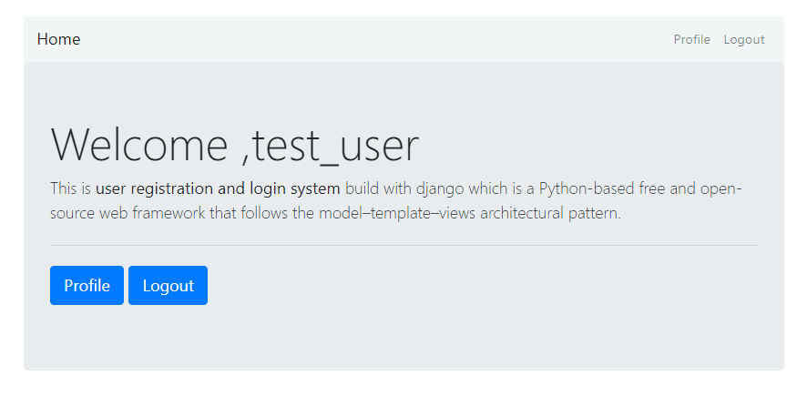
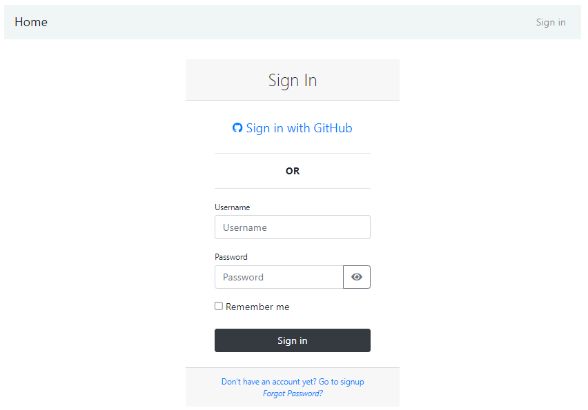
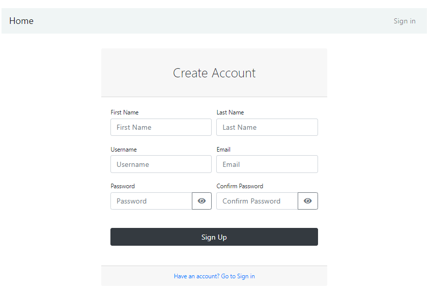
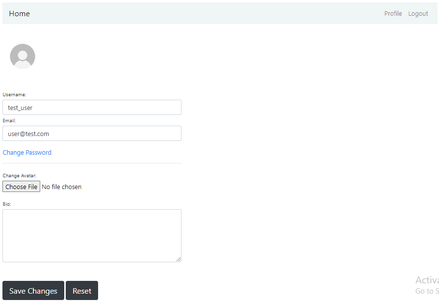
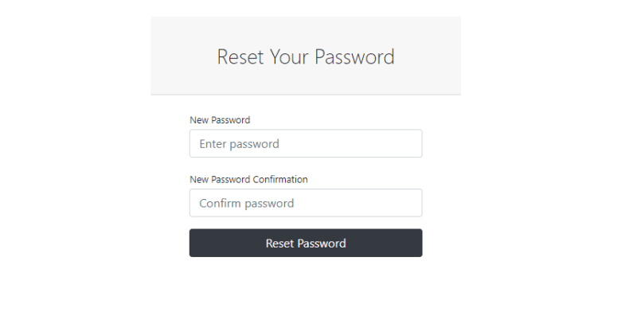
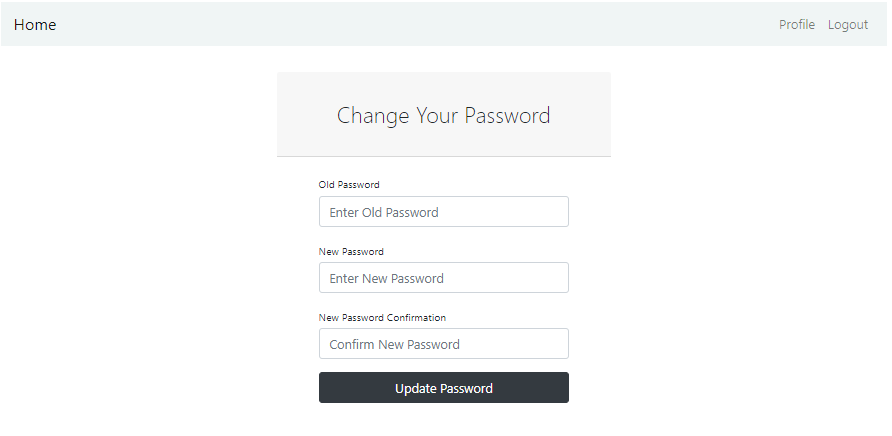
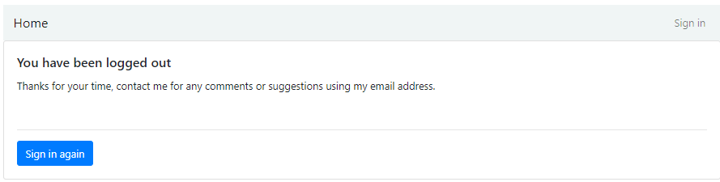

# Django Simple Login System

## Overview

This project implements a simple login system using Django, a high-level Python web framework. The login system allows users to register, log in, and log out.

## Features

- User registration
- User login
- User logout
- Password reset

## Prerequisites

Make sure you have the Python installed:

- Python (version 3.x recommended)

## Note:
In the command line, type `python`. If Python is installed, you should see a message like “Python 3.x.x” followed by the Python prompt, which looks like this “>>>”. Note that “3.x.x” represents the version number of Python

```bash
python
# OR
python --version
```

# Demo:

## Homepage



## Login



## Register



## Profile



## Passwor reset



## Password-change



## Logout



**1.Clone the Repo**

```sh
git clone https://github.com/Kaiyrtay/Django-LoginSystem.git
cd Django-LoginSystem
```

**2.Install Requirements**

```sh
pip install -r requirements.txt
```

**3.Create .env**

```sh
cd ~/Django-LoginSystem/mysite
touch .env
```

At your .env file:

```bash
DEBUG=True/False

SECRET_KEY=<your_value>

SOCIAL_AUTH_GITHUB_KEY=<your_value>
SOCIAL_AUTH_GITHUB_SECRET=<your_value>

EMAIL_USER=<your_value>
EMAIL_PASSWORD=<your_value>
```

**4.Apply migrations:**

```bash
python manage.py migrate
```

**5.Create a superuser (admin):**

```bash
python manage.py createsuperuser
```

**6.Start the development server:**

```bash
python manage.py runserver
```

# End

> Good luck.
